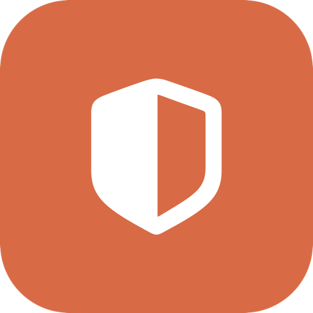

<div align="center">



# LockIn

**A focus blocker for macOS that stays locked until your time is up.**

Block distracting websites and apps on a schedule you set once — across every browser and app, with no extension and no quick off switch.

[](https://github.com/HumbleBee14/LockIn/releases/latest)
[](#requirements)
[](LICENSE)

</div>

---

## Why LockIn

Most blockers have a pause button — and at 11pm, you'll use it. LockIn is built around the opposite idea: once a session starts, there is no quick way to turn it off until the window ends. It blocks at the system level, so a single session covers Safari, Chrome, Firefox, and every app at once — no browser extension to install or disable.

It's designed to get you past the moment of temptation, automatically and on schedule.

## Features

- **Recurring schedule** — block on a weekly schedule, set it once and forget it
- **Websites and apps** — covers every browser system-wide, no extension required
- **Reusable block sets** — group sites, start from a category, or build your own
- **Flexible importing** — load lists from a file, a pasted list, or a public blocklist URL
- **Clock-tamper resistant** — resists common workarounds like jumping the system clock forward
- **Survives interference** — keeps enforcing across app quit, kill, and reboot
- **Native and clean** — a focused SwiftUI interface, no clutter

## Install

Install with [Homebrew](https://brew.sh):

```sh
brew tap humblebee14/lockin
brew trust humblebee14/lockin
brew install --cask lockin
```

Upgrade later:

```sh
brew upgrade --cask lockin
```

Or download the latest signed `.dmg` from the [Releases page](https://github.com/HumbleBee14/LockIn/releases/latest).

## Requirements

macOS 13 (Ventura) or later. Apple Silicon and Intel.

## Privacy

LockIn keeps your data on your Mac and collects no analytics. See [PRIVACY.md](PRIVACY.md).

## Building from source

See [BUILD.md](BUILD.md) for build and development setup, and [RELEASE.md](RELEASE.md) for the release process.

## License

[GPLv3](LICENSE). LockIn draws inspiration from [SelfControl](https://github.com/SelfControlApp/selfcontrol) and similar focus tools, and extends the idea with a recurring scheduler, clock-tamper resistance, app blocking, and a native macOS UI.
